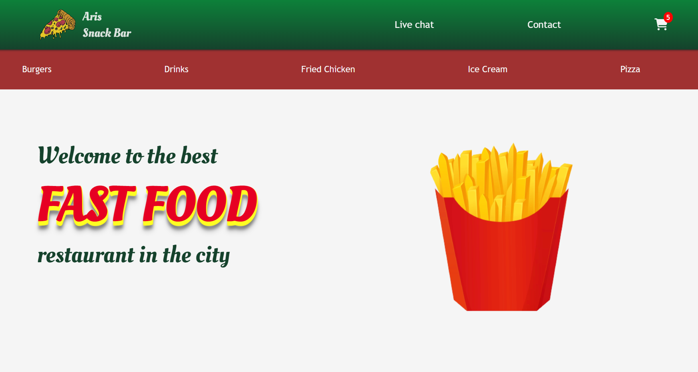

# Food Order App

[View Live Web App](https://courageous-frangipane-c90c9e.netlify.app/)

## Description

&nbsp;&nbsp;&nbsp;&nbsp;A fully responsive app, where a customer can make
his order from the products list and send it to the 
[Admin Dashboard](https://6378372e9d407f764d34917b--subtle-nasturtium-5d32c7.netlify.app/).
The whole proccess works with the aid of the common 
[HTTP Server](https://github.com/Aris-Empanta/Food_Order_App---Server).
A detailed description of each feature will be explained below, 
in the Feature Section. 

## Main Technologies used

- React
- Redux toolkit
- Vanilla JavaScript
- CSS
- Socket.io ( client )
- Axios

## Features

### Products
&nbsp;&nbsp;&nbsp;&nbsp;Once the app loads, it fetches all the product categories from the server,
and creates the menu navigation bar. Once the user clicks on a category,
The dynamic Products Component fetches all the products from the database,
and stores them in the Redux global store. Then, when you navigate to different
categories, it displays only the products from the specific category existing
in the Redux store.

&nbsp;&nbsp;&nbsp;&nbsp;The reason for the procedure mentioned above, is so that the user can 
navigate to different categories without waiting each time to fetch the products
from the database. It is efficient, because the amount of a restaurant menu is
most of the time small to medium.

### Shopping cart
&nbsp;&nbsp;&nbsp;&nbsp;The products the user choose, are stored in the global Redux store.
Then, you can navigate to the shopping cart, which has access to the complete order you make.
even if you refresh the page or close it, the shopping cart chosen
products remain, with the aid of the Redux Persist library.

&nbsp;&nbsp;&nbsp;&nbsp;Once you chose the products you want and you 
click procceed, you navigate to the customer info section. Then, if you are a new customer, 
you fill up the form with your info, and you can choose either to save
your information or not for a future purchase. If we already have your info,
you can just put your email and the app can fetch all you remaining info from the database.

&nbsp;&nbsp;&nbsp;&nbsp;When you confirm your info, you navigate to
the captcha confirmation section - which is made with pure CSS and JavaScript.
Then, once you click "Confirm Purchase", your order is send in real time to the
[Admin Dashboard](https://6378372e9d407f764d34917b--subtle-nasturtium-5d32c7.netlify.app/),
 it is saved to the MySql database, and at the same time the [HTTP Server](https://github.com/Aris-Empanta/Food_Order_App---Server)
 generates an invoice with you order information with the help of 
 the PDFKit library. The customer can have access to the invoice from the next Component
 he navigates to, after he "Confirm Purchase".  
 
 ### Live Chat

 &nbsp;&nbsp;&nbsp;&nbsp;The customer can communicate in real time with the Admin / Owner
 through the live chat, with the aid of socket.io library. The customer enters his 
 desired username, which is stored as params to the url, with the use of React Router useParams Hook.
 Then he can send and receive messages with this username to the 
 [Admin Dashboard](https://6378372e9d407f764d34917b--subtle-nasturtium-5d32c7.netlify.app/),
 which are saved to the MySql database at the same time.

 ### Contact form

  &nbsp;&nbsp;&nbsp;&nbsp;The customer can also use the contact form to send
  a message to the Admin / Owner's email. The procedure is carried out with 
  the assistance of the common [HTTP server](https://github.com/Aris-Empanta/restaurant-server),
  which send the customer's message to the admin's mail using the NodeMailer library.